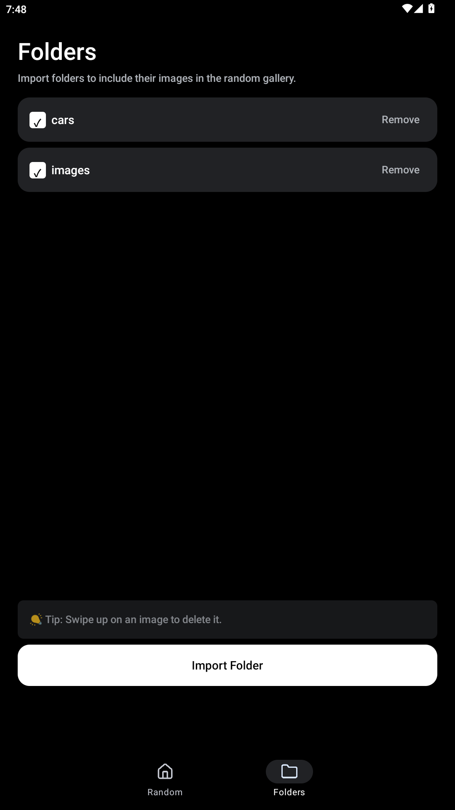

  

<h1 align="center">Random Gallery</h1>

  <strong>Shuffle. Browse. Delete.</strong> 
  A random-browsing photo gallery for Android.

  ⚠️ Built with vibe coding — expect quirks.

  <a href="#download">Download APK</a> ·
  <a href="#features">Features</a> ·
  <a href="#how-it-works">How It Works</a>

---

## Download

> 📦 Latest APK: [Releases](../../releases/latest)

Download the APK, install it on your Android device, and start browsing.

## Features

|                           |                                                                          |
| ------------------------- | ------------------------------------------------------------------------ |
| 🔀 **Random shuffle**     | All photos shuffled once; tap ↻ to reshuffle                             |
| 📁 **Folder import**      | Pick folders via Android SAF                                             |
| ✅ **Selective browsing** | Toggle folders on/off with checkboxes                                    |
| 🔍 **Full-screen viewer** | Pinch to zoom, swipe to navigate, swipe up to delete, swipe down to exit |

## How It Works

1. Open the **Folders** tab and tap "Import Folder" to pick a photo folder
2. Use checkboxes to choose which folders to include
3. Switch to the **Random** tab — your photos appear in shuffled order
4. Tap ↻ in the bottom-right to reshuffle at any time
5. Tap any thumbnail to view it full-screen
6. Swipe up to delete, swipe down to exit the viewer

Images are read directly from their source folders via MediaStore and SAF. The app never copies or moves your files.

## Screenshots

  
  &nbsp;
  
  &nbsp;
  

